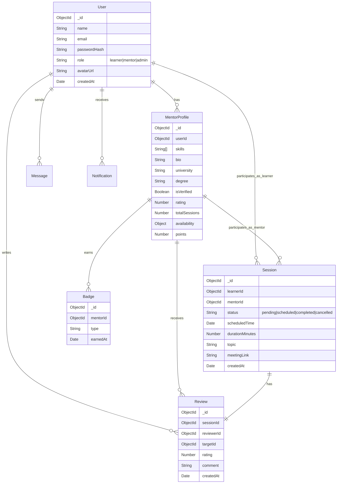

# Database Schema (MongoDB)

## 1. Entity Relationship Diagram (ERD)



## 2. Mongoose Schemas

### User Schema
```javascript
const UserSchema = new mongoose.Schema({
  name: { type: String, required: true },
  email: { type: String, required: true, unique: true },
  password: { type: String, required: true },
  role: { type: String, enum: ['learner', 'mentor', 'admin'], default: 'learner' },
  avatar: { type: String },
  isVerified: { type: Boolean, default: false }, // For email verification
}, { timestamps: true });
```

### Mentor Profile Schema
```javascript
const MentorProfileSchema = new mongoose.Schema({
  user: { type: mongoose.Schema.Types.ObjectId, ref: 'User', required: true },
  skills: [{ type: String }], // e.g., ['React', 'Calculus', 'Python']
  bio: String,
  university: String,
  degree: String,
  verificationDocuments: [String], // URLs to uploaded docs
  isApproved: { type: Boolean, default: false }, // Admin approval
  rating: { type: Number, default: 0 },
  reviewCount: { type: Number, default: 0 },
  points: { type: Number, default: 0 },
  badges: [{ 
    name: String, 
    icon: String, 
    earnedAt: Date 
  }],
  availability: [{
    day: String, // 'Monday'
    slots: [String] // ['10:00-11:00', '14:00-15:00']
  }]
}, { timestamps: true });
```

### Session Schema
```javascript
const SessionSchema = new mongoose.Schema({
  learner: { type: mongoose.Schema.Types.ObjectId, ref: 'User', required: true },
  mentor: { type: mongoose.Schema.Types.ObjectId, ref: 'MentorProfile', required: true },
  topic: { type: String, required: true },
  description: String,
  status: { 
    type: String, 
    enum: ['pending', 'accepted', 'scheduled', 'completed', 'cancelled'], 
    default: 'pending' 
  },
  scheduledAt: { type: Date },
  duration: { type: Number, default: 60 }, // minutes
  meetingLink: String,
  notes: String
}, { timestamps: true });
```

### Review Schema
```javascript
const ReviewSchema = new mongoose.Schema({
  session: { type: mongoose.Schema.Types.ObjectId, ref: 'Session', required: true },
  reviewer: { type: mongoose.Schema.Types.ObjectId, ref: 'User', required: true },
  mentor: { type: mongoose.Schema.Types.ObjectId, ref: 'MentorProfile', required: true },
  rating: { type: Number, required: true, min: 1, max: 5 },
  comment: String
}, { timestamps: true });
```

### Chat Message Schema
```javascript
const MessageSchema = new mongoose.Schema({
  sender: { type: mongoose.Schema.Types.ObjectId, ref: 'User', required: true },
  receiver: { type: mongoose.Schema.Types.ObjectId, ref: 'User', required: true },
  content: { type: String, required: true },
  read: { type: Boolean, default: false }
}, { timestamps: true });
```

### Notification Schema
```javascript
const NotificationSchema = new mongoose.Schema({
  user: { type: mongoose.Schema.Types.ObjectId, ref: 'User', required: true },
  type: { type: String, enum: ['session_req', 'session_accepted', 'message', 'system'] },
  message: String,
  relatedId: mongoose.Schema.Types.ObjectId, // ID of session or message
  read: { type: Boolean, default: false }
}, { timestamps: true });
```
